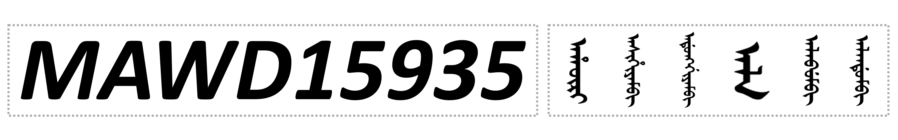

<p align="center">
  
</p>

# A Large-Scale Manchu Archives Word Dataset

> ● This repository serves as the public project page for MAWD15935. \
> ● The supplementary material is available through this website. \
> ● The full dataset has been uploaded and will be made available to ACM MM 2026 Dataset Track chairs and reviewers through anonymous review access upon request via the official communication channel.

[`中文`](./docs/README-CN.md) ｜ [`ENG`](./README.md)

## 🔍 Introduction

**MAWD15935** is the first large-scale dataset for **Manchu archival word recognition**, containing **1,092,744** word images derived from **15,935** Manchu words, including **975,301** printed samples and **117,443** handwritten samples. The dataset is mainly constructed from the *New Comprehensive Manchu-Chinese Dictionary* and authentic Qing Dynasty Manchu archives preserved in the Dalian Library. In particular, all handwritten samples are collected from real archival scan images, which makes the dataset highly valuable for research on historical document analysis. With its large vocabulary size, diverse writing styles, and authentic archival characteristics, MAWD15935 provides a solid benchmark for Manchu word recognition, historical document understanding, and the digitization of endangered language resources.

---

## 📙 Supplementary Materials

The supplementary materials associated with this paper are available in [`Supplementary Material.pdf`](./Supplementary%20Material.pdf).

## 🧩 Dataset Structure

```text
MAWD15935
├── encoding_conversion_rules
│   ├── grapheme encoding.docx
│   ├── latin transliteration.docx
│   └── Table of Conversion Relations Between Latin Characters and Manchu Grapheme Encoding.pdf
├── extra_data
│   ├── Manchu Dataset of Real Handwritten Archives (2805)
│   │   ├── aba
│   │   │   ├── aba_0.png
│   │   │   └── aba_1.png
│   │   ├── abade
│   │   │   ├── abade_0.png
│   │   │   ├── abade_1.png
│   │   │   ├── abade_2.png
│   │   │   └── abade_3.png
│   │   ├── ......
│   └── extra_data_intro.pdf
├── main_data
│   ├── data_docx
│   │   ├── 1.docx
│   │   ├── 2.docx
│   │   ├── 3.docx
│   │   ├── 4.docx
│   │   ├── 5.docx
│   │   └── ...... (14270 more files)
│   └── data_docx_intro.pdf
└── main_data_anno
    ├── annotation.xlsx
    └── main_data_anno_intro.pdf
```

## 📂 Dataset Overview

The released **MAWD15935** repository is organized into four main parts: **encoding_conversion_rules**, **extra_data**, **main_data**, and **main_data_anno**. Related files can be found in the dataset compressed file or  [`here`](./docs/).

### 1. `encoding_conversion_rules`
This folder provides supporting materials for script conversion and annotation interpretation, including:

- `latin transliteration.docx`
- `grapheme encoding.docx`
- `Table of Conversion Relations Between Latin Characters and Manchu Grapheme Encoding.pdf`

These files describe the correspondence between Manchu grapheme encoding and Latin transliteration, and are intended to help users understand the annotation system adopted in MAWD15935.

### 2. `extra_data`
This part contains the **real handwritten archival Manchu word data**:

- `Manchu Dataset of Real Handwritten Archives (2805)`
- `extra_data_intro.pdf`

The handwritten data are sourced from the **Qing Dynasty Imperial Household Department Archives in the Collection of Dalian Library**.  
This subset contains **2,805 categories of Manchu words** and **117,443 samples**.

Samples of the same word are stored in the same folder.  
Each folder is named by the **Latin transliteration** of the corresponding Manchu word, and image files inside that folder follow the same naming convention. For example, the folder `zhuwe` contains only image samples of the word *zhuwe*. Among these 2,805 handwritten categories, **1,145 words overlap with the entries in the New Comprehensive Manchu-Chinese Dictionary**.

### 3. `main_data`
This part provides the **printed Manchu word documents in 11 fonts**:

- `data_docx`
- `data_docx_intro.pdf`

The data are derived from the `manchu_new_base_14536` dataset.  
Both the serial numbers and the Manchu words are consistent with that source. Files are named by the **serial number** of each Manchu word.

In total, this section contains **14,275 Manchu words**, each presented in **11 font styles**, namely:

- ZhengBai
- WenJian
- YaBai
- GuFeng
- ZhengHei
- BiaoHei
- WenQin
- XingShu
- LiuYe
- YingBi
- ShuKai

These font documents provide the printed component of the dataset and serve as an important complement to the handwritten archival samples. The corresponding 11 TTF font files are available in the [`fonts`](./fonts) directory under the repository root.

### 4. `main_data_anno`
This part contains the **annotation table** for the Manchu words:

- `annotation.xlsx`
- `main_data_anno_intro.pdf`

The annotation file records the key metadata of each word, including:

- serial number
- Latin transliteration
- Chinese translation
- remarks
- corresponding forms in 11 fonts

More specifically:

- Column A: serial number
- Column B: Latin transliteration
- Column C: Chinese translation
- Column D: remarks
- Column E: repeated serial number
- Columns F to P: 11 font forms of the Manchu word

Entries marked in red in the original annotation table indicate incorrect Manchu words that should be removed. These incorrect entries have already been deleted from the constructed dataset.

## 📊 Dataset Statistics

MAWD15935 contains **1,092,744** word image samples derived from **15,935** distinct Manchu words.

### Basic Statistics

| Item | Value |
|---|---:|
| Total samples | 1,092,744 |
| Distinct Manchu words | 15,935 |
| Printed samples | 975,301 |
| Handwritten samples | 117,443 |
| Printed word categories | 14,275 |
| Handwritten word categories | 2,805 |
| Overlapping words between printed and handwritten subsets | 1,145 |
| Number of printed font styles | 11 |

### Subset Composition

The dataset is composed of two complementary parts: a large-scale printed subset and a real handwritten archival subset.

The **printed subset** contains **975,301** samples from **14,275** Manchu words. Each word is presented in **11 font styles**, which provide substantial variation in printed appearance and enrich the visual diversity of the dataset.

The **handwritten subset** contains **117,443** samples from **2,805** Manchu words. These samples are collected from real Qing Dynasty archival documents and reflect authentic handwriting styles in historical Manchu archives.

There are **1,145 overlapping words** shared by the printed and handwritten subsets. After merging the two parts and removing duplication at the vocabulary level, the final dataset contains **15,935 distinct Manchu words**.

### Distribution Characteristics

The dataset exhibits both large vocabulary coverage and substantial sample diversity.

For the handwritten subset, more than **90 percent** of the Manchu words have **over 20 samples**.  
For the printed subset, more than **95 percent** of the Manchu words have **between 30 and 100 samples**.

Overall, MAWD15935 combines broad lexical coverage, rich font variation, and authentic archival handwriting, making it a valuable resource for Manchu archival word recognition and historical document analysis.

## ⏬ Download

To preserve the review workflow, the direct download links are not publicly listed during the review period.  
Review-only access information will be provided **upon request from the Dataset Track Chairs via the official communication channel**.

| Resource | Link | Password |
|---|---|---|
| BaiduNetDisk | [BaiduNetDisk](https://pan.baidu.com/s/1qy7MD1Hu0fVY_6vYbGN6sg) | Available through the official review channel |
| Google Drive | Available through the official review channel | None |

## 🔗 Citation

If you use **MAWD15935** in your research, please cite the following temporary reference:

```bibtex
@misc{mawd15935,
  title={MAWD15935: A Large-Scale Manchu Archives Word Dataset},
  author={Jianjun He and Yucheng Wang and Fengzhi Bao and Yu Zhou and Zhengxu Jin and Ruirui Zheng},
  year={2026},
  note={Under review},
  howpublished={GitHub repository}
}
```

## ⭕️ License and Terms of Use

### Code License

Unless otherwise specified, the code and scripts in this repository are released under the **MIT License**.

### Data License

The **MAWD15935** dataset, including word images, annotations, documents, and supplementary materials, is provided for **non-commercial research and educational use only**.

By accessing or using this dataset, users agree to the following terms:

1. The dataset may be used only for academic research, teaching, and educational purposes.
2. Commercial use, redistribution for commercial purposes, or incorporation into commercial products or services is not permitted without prior written permission from the copyright holders.
3. Users must properly cite the MAWD15935 paper and this repository in any publication or derivative work based on the dataset.
4. Users may not redistribute the complete original dataset to third parties without permission.
5. Users may create processed results for research purposes, but must not remove attribution, copyright notices, or source information.
6. Users must comply with any additional requirements related to the original archival sources and third-party materials.
7. The dataset is provided “as is”, without warranties of any kind regarding completeness, accuracy, or fitness for a particular purpose.

### Third-Party Materials

Some materials in this repository, such as font files or archival source-related content, may be subject to additional third-party rights or restrictions. Users are responsible for complying with the corresponding terms where applicable.

### Contact

For licensing questions, permission requests, or commercial inquiries, please contact the authors listed in the [Contact Information] section.

## 📮 Contact Information

For questions about the dataset, annotations, and related research, please contact:

- **Ruirui Zheng** (zrr@dlnu.edu.cn) — Corresponding author
- **Yucheng Wang** (wyc_24kbaekhyun@163.com) — Repository owner and maintainer of this GitHub project
- **Jianjun He** (jianjunhe@live.com) — First author and primary writer of this work

For repository issues, updates, and documentation-related problems, users may also open an issue on this GitHub repository.
